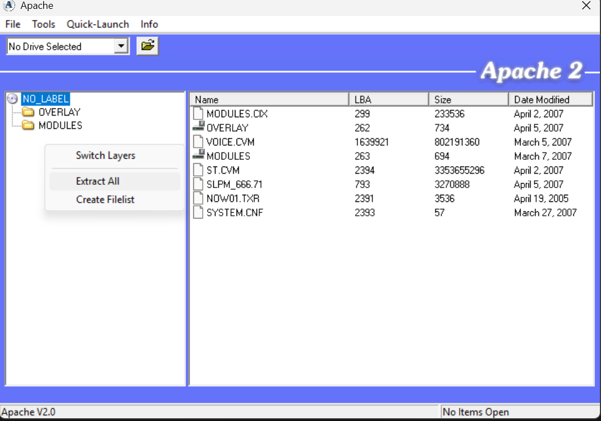
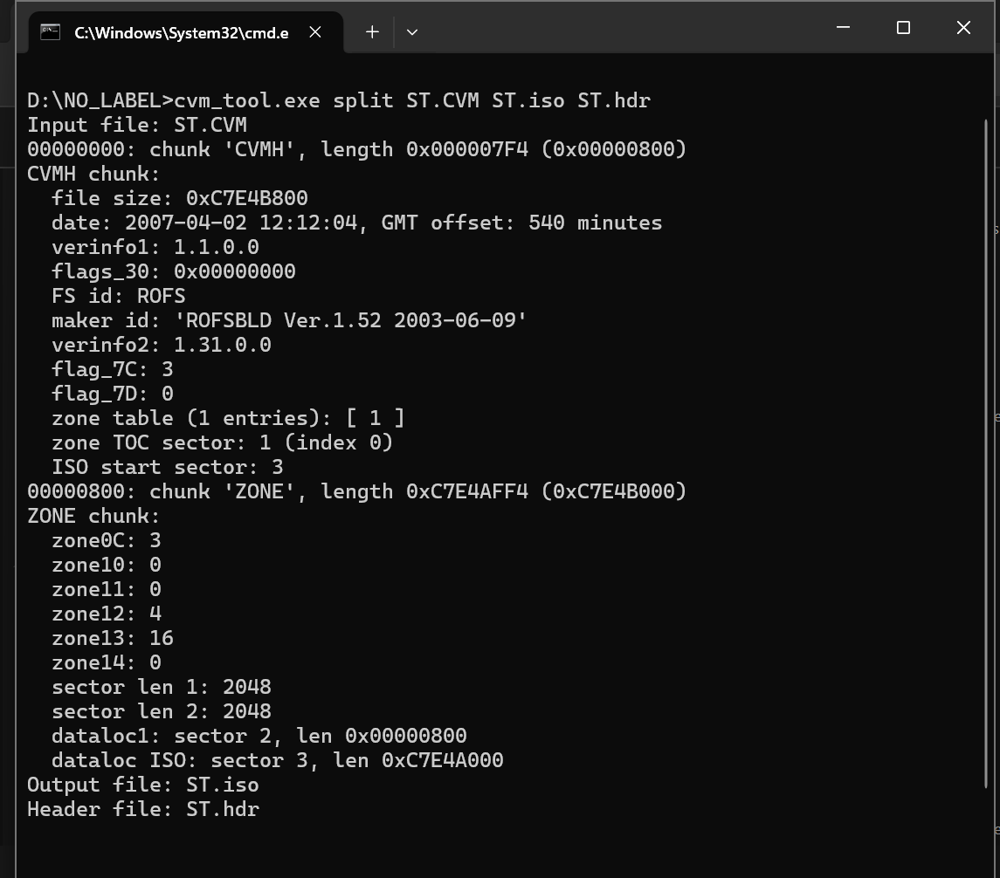
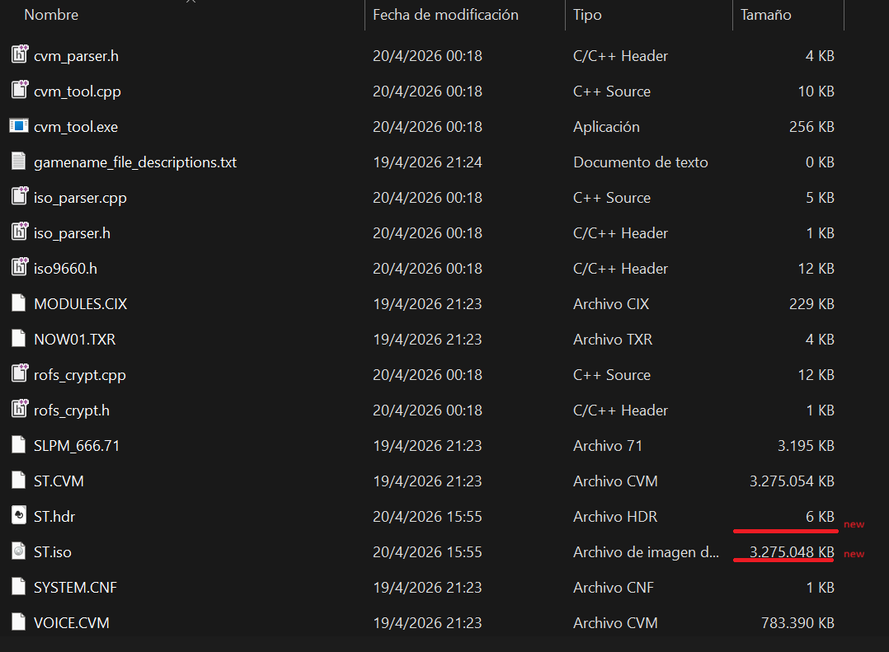

# 📦 Game Extraction Process (PS2)

Este documento describe el proceso utilizado para extraer los archivos del juego desde la ISO original hasta acceder a los recursos internos como texturas y datos.

---

## 🧰 Herramientas utilizadas

* Apache2 (PS2 ISO explorer)
* CVM Tool (roxfan)
* WindHex
* QuickBMS
* CrystalTile2
* Tabla SJIS (para texto japonés)

---

## 🥇 Paso 1 — Extraer la ISO

Se utilizó **Apache2** para abrir la imagen `.iso` del juego.

**Proceso:**

1. Abrir Apache2
2. Cargar la ISO del juego
3. Extraer todos los archivos

📸 *Sugerencia de imagen:*




---

## 🥈 Paso 2 — Extraer archivo CVM

Dentro de los archivos extraídos se encontró un archivo:

```text
ST.CVM
```

Este archivo es un contenedor que incluye más datos del juego.

Para extraer su contenido, se utilizó **CVM Tool**:

🔗 https://github.com/mchubby/RE-games-attic/raw/master/sega-nextech/cvm_tool%20%5Broxfan%5D/cvm_tool_02.zip

---

## 🧪 Conversión de CVM a ISO

Se ejecutó el siguiente comando en la terminal:

```bash
cvm_tool.exe split ST.CVM ST.iso ST.hdr
```

Esto genera:

```text
ST.iso  → imagen accesible
ST.hdr  → header separado
```

📸 *Sugerencia de imagen:*

* Consola ejecutando el comando
* Archivos generados

---

## 🥉 Paso 3 — Acceder al contenido interno

El archivo `ST.iso` se puede:

* montar como unidad virtual
* abrir con herramientas como 7-Zip

Esto permite acceder a más archivos internos del juego.

💡 En este caso, el archivo **no tenía protección**, por lo que no fue necesario ningún password.

---

## 🧰 Paso 4 — Herramientas adicionales

Una vez accedido el contenido interno, se utilizaron varias herramientas clave:

### 🔍 WindHex

Para inspección hexadecimal de archivos.

📸 




---

### 🔤 Tabla SJIS

Para interpretar texto japonés:

🔗 https://www.romhacking.net/download/documents/179/

---

### 📦 QuickBMS

Para extracción de archivos binarios y contenedores.

---

### 🧩 CrystalTile2

Para:

* visualizar texturas
* detectar offsets
* analizar formatos gráficos

📸 *Sugerencia:*

* Imagen mostrando una textura correctamente alineada
* Cambio de offset (ej: 0x170)

---

## ⚠ Estado actual

✔ Acceso completo a archivos del juego
✔ Extracción de texturas (`.txr → .raw`)
✔ Visualización parcial de imágenes
✔ Extracción de texto

❌ Reempaquetado de `.CVM` aún no resuelto

---

## 🧠 Notas

* Los archivos `.CVM` funcionan como contenedores tipo ISO
* Muchos recursos del juego están dentro de estos archivos
* El análisis requiere herramientas específicas de PS2

---

## 🚀 Próximos pasos

* Reempaquetar `.CVM`
* Automatizar extracción
* Procesar texturas completamente (paleta + swizzle)
* Reinsertar modificaciones en el juego

---
